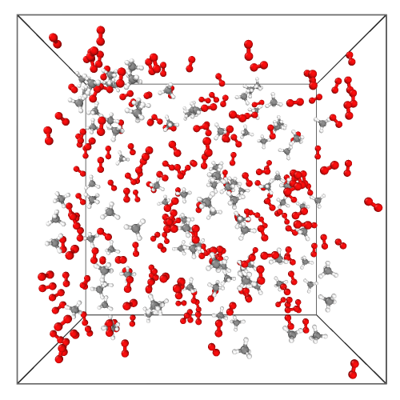
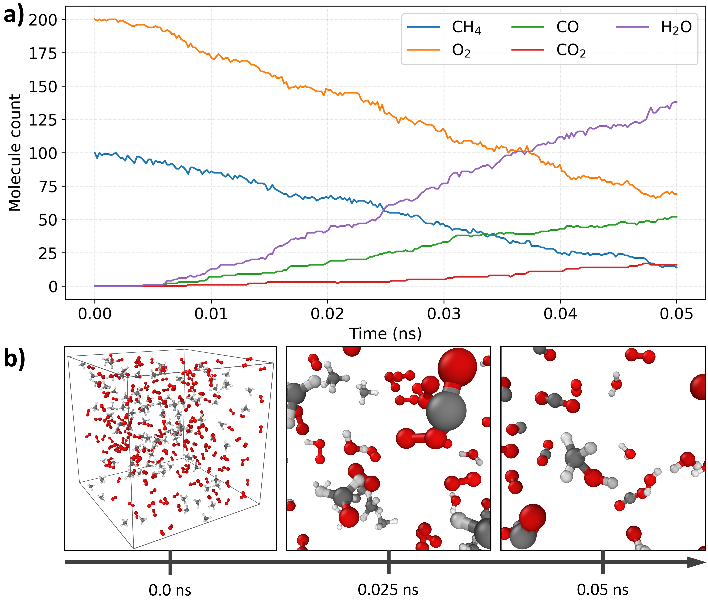

# DFTorch

DFTorch is a Density Functional Tight Binding (DFTB) implementation in PyTorch.

## Installation

### uv (recommended)

```bash
cd DFTorch
uv venv --python 3.11
uv pip install .
uv sync
```

or for compatibility with [sedacs](https://github.com/lanl/sedacs)

```bash
uv pip install -e ".[sedacs]"
uv sync
```

Run tests:
```bash
uv run pytest
```

### pip
To install DFTorch, run:

```bash
pip install .
```

## Running DFTorch

DFTorch is a Python library, not a standalone command-line application. After
installation, run it by importing `dftorch` from a Python script, a notebook,
or an interactive Python session.

If you installed with `uv`, use `uv run` so commands execute inside the
project environment without manually activating `.venv`. The installation
commands above build DFTorch from `pyproject.toml` rather than syncing from
`uv.lock`.

```bash
uv run python
```

```python
from dftorch import Constants, Structure, ESDriver
```

Run a script with:

```bash
uv run python your_script.py
```

For notebook-based usage, launch Jupyter from the same environment:

```bash
uv run jupyter lab
```

For notebook-based usage, open one of the example notebooks in `experiments/`,
for example `experiments/1_tutorial.ipynb`, and run the cells with your chosen
Python environment.


## Requirements
- torch
- numpy
- scipy
- pandas

## Usage

See `experiments/1_tutorial.ipynb` for examples.

## Main Capabilities

- SCC-DFTB calculations in PyTorch for single structures and batched multi-structure workloads.
- DFTB3 support, including diagonal-only and full third-order charge corrections.
- Restricted and unrestricted/open-shell electronic structure calculations with finite-temperature occupations.
- Non-periodic and periodic simulations with full Coulomb summation and Particle Mesh Ewald (PME) electrostatics.
- [NVIDIA ALCHEMI](https://github.com/NVIDIA/nvalchemi-toolkit-ops) neighbor-list generation backend for accelerated neighbor-list construction.
- Analytical and autograd forces and stress tensors.
- Delta-SCF excited-state calculations for targeted non-Aufbau electronic excitations.
- Extended-Lagrangian Born-Oppenheimer molecular dynamics ([XL-BOMD](https://link.springer.com/article/10.1140/epjb/s10051-021-00151-6)), including batched MD drivers.
- NVT and NPT molecular dynamics with Langevin thermostat and Berendsen barostat.
- Geometry optimization for atomic positions and periodic cells.
- Implicit solvation ([GBSA/ALPB](https://pubs.acs.org/doi/full/10.1021/acs.jctc.1c00471)).
- D3(BJ) dispersion.
- Hydrogen bond damping ([$γ^h$](https://pubs.acs.org/doi/10.1021/ct100684s) and [H5](https://pubs.acs.org/doi/10.1021/acs.jctc.7b00629)).
- Automatic differentiation with respect to coordinates and selected model parameters for backpropagation workflows.
- GPU acceleration through PyTorch, with optional compile-time optimization and differentiable tensor workflows.
- [SEDACS](https://github.com/lanl/sedacs) interface for massively parallel simulations of up to 100,000 atoms.

### Public API

Supported public imports:

```python
from dftorch import (
    Constants,
    Structure,
    StructureBatch,
    ESDriver,
    ESDriverBatch,
    MDXL,
    MDXLBatch,
    Optimizer,
)
```

All other modules are internal implementation details and may change.


### Minimal Example

```python
import torch
import os
torch.set_default_dtype(torch.float64)

# To disable torchdynamo completely. Faster for smaller systems and single-point calculations. Set to True to test torch.compile.
ENABLE_TORCH_COMPILE = False
os.environ["DFTORCH_ENABLE_COMPILE"] = "1" if ENABLE_TORCH_COMPILE else "0"
if ENABLE_TORCH_COMPILE: os.environ.pop("TORCHDYNAMO_DISABLE", None)
else: os.environ["TORCHDYNAMO_DISABLE"] = "1"

from dftorch import Constants, Structure, ESDriver

dftorch_params = {
    "FILENAME": "COORD.pdb",
    "SKFPATH": "sk_orig/mio-1-1/mio-1-1/",  # Path to SKF files
    "T_ELECTRONIC": 1000.0,  # Electronic temperature in Kelvin for Fermi smearing
    "RCUT_ELECTRONIC": 7.0,  # Electronic cutoff in Angstroms. Should be >= largest cutoff in SKF files for the element pairs present in the system.
    "RCUT_REPULSIVE": 4.0,   # Repulsive cutoff in Angstroms. Should be >= largest cutoff in SKF files for the element pairs present in the system.
    "COUL_METHOD": "PME",    # Coulomb method. 'PME' for Particle Mesh Ewald.
}

device = "cuda" if torch.cuda.is_available() else "cpu" # Use GPU if available, otherwise CPU
const = Constants(dftorch_params).to(device) # Constants container with parameters
structure1 = Structure(dftorch_params, const, device=device) # Initialize structure from input file (COORD.pdb)
es_driver = ESDriver(dftorch_params, device=device) # Initialize electronic structure driver
es_driver(structure1, const) # Compute electronic structure and forces, with SCF convergence
print(f"  {'E_total':22s} {structure1.e_tot:12.6f} Ev")
```

### Methane Combustion Demo
- DFTB2, mio-1-1
- 100 $CH_4$ + 200 $O_2$.
- Langevin thermostat at T = 3200 K.
- 0.05 ns, 200,000 step, Δt=0.25 fs.
- 0.3 s wall time per MD step on  NVIDIA A100 GPU.

<p align="left">
  
</p>

<p align="left">
  
</p>

## Authors
 M. Kulichenko, A.P. Baldo, A.M.N. Niklasson
